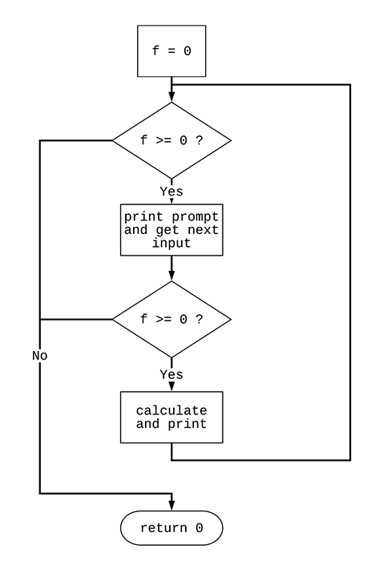
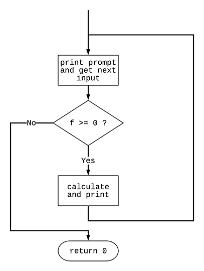

# Project - More sophisticated logical selection

## Goal

Starting with the code we have already written which converts a number
of degrees F into the equivalent degrees in C, you are going to:

* design an algorithm which allows the user to select the direction of
the conversion (F to C or C to F).

* flowchart the algorithm

* write the program that implements the algorithm.

## Review

Below is the code we wrote in class. Let's review it.

We learned that functions are bundles of potentially reusable code that
perform some block of statements that make logical sense to group
together.

Functions that we've seen so far can be likened to verbs - do
*something*. In the case of our in-class version of the temperature
conversion program, we defined a function called `F2C()` which accepted
an integer argument (or parameter) that allowed us to reuse the function
with any value of degrees.

We learned that functions can return values. `F2C()`, given a degrees F,
will return the degrees in C. We talked about but did not work with
functions that don't return values (their return type is `void`).

We learned that functions are a **good idea**. They break down our
designs into smaller ideas which are more understandable.

We learned that all C++ programs (that we will be writing) must include
a function called `main()`. This function is special only in that it is
where your program will begin executing.

We know that we can print out something to the user using `cout` and
read in something from the user using `cin`. We talked about `cout` and
`cin` being `streams` but we don't know what those are. For now we know
that `cout` is your screen and `cin` is your keyboard. There is a lot
more to learn about streams.

We learned about the `while` loop: *While a certain condition evaluates
to true* repeat a block of code*.

After the block of code executes, control transfers back up top where
the condition is evaluated again. If the condition is now false, control
transfers to after the end of the block nested under the `while`.

We learned that one way of escaping a `while` loop early (i.e. from
within the middle of the block of code), is using a `break` statement.
We learned that `break` statements can exist only inside loops and in
one other place, but we didn't talk about the other place.

Here's the code:

```c++
#include <iostream>

using namespace std;

int F2C(int degrees) { return 5 * (degrees - 32) / 9; }

int main() {
  int degrees = 0;
  int celsius;

  while (degrees >= 0) {
    cout << "Enter degrees (negative quits): ";
    cin >> degrees;
    if (degrees < 0)
      break;
    celsius = F2C(degrees);
    cout << degrees << " in degrees is " << celsius << " in celsius" << endl;
  }
  return 0;
}
```

We learned about flowcharting. We learned that flowcharts help us design
algorithms by putting pictures and symbols to the sequence of steps the
algorithm will contain.

Flowcharts are good design tools. Here is the flowchart for the program
above. Take a few moments to compare the code to the flowchart. Where
you see `f` in the flowchart, think `degrees`.



Here is a slightly cleaner way of writing the same code:

```c++
#include <iostream>

using namespace std;

int F2C(int degrees) { return 5 * (degrees - 32) / 9; }

int main() {
  int degrees;
  int celsius;

  while (true) {
    cout << "Enter degrees (negative quits): ";
    cin >> degrees;
    if (degrees < 0)
      break;
    celsius = F2C(degrees);
    cout << degrees << " in degrees is " << celsius << " in celsius" << endl;
  }
  return 0;
}
```

Why is this cleaner? Look:



The key idea that made the second version cleaner is the construction
`while (true)` which always passes. Execution falls directly into the
user's entrance of the value for degrees which, if negative leads to
exiting the loop using the ```break``` statement.

## if statements

We have learned about `if` statements in class. Let's make use of them
in an assignment. Your instructor has been a little sneaky here
(instructors usually are, but it's all for the good).

The `while` loop contains an implicit `if` statement within it. Above we
said *while a certain condition evaluates to true* enter the block of
code. The implicit `if` is that you enter the block of code only `if`
the condition evaluates to true.

The program you will write is more flexible than the one we wrote in
class. This one asks the user which direction they want to perform
a temperature conversion.

Digression: did you know there is a
difference between heat and temperature?

After you prompt the user, they
choose between converting from F to C or from C to F. They can also
elect to quit the program.

Here is what your output should look like:

```text
Select from F, C or Q (to quit): F
Enter degrees F: 32
32 F is 0 degrees C.
Select from F, C or Q (to quit): C
Enter degrees C: 100
100 C is 212 degrees F.
Select from F, C or Q (to quit): SPLAT!
Bad command.
Select from F, C or Q (to quit): Q
```

The snippet above shows all of the potential code paths including
what to do if the user enters something other than F, C or Q.

## Requirements

You will use some combinations of `if`, `else if` and
`else`.

You are to turn in a flowchart showing the structure of your program.
Remember that diamonds are used for `if` statements. Also remember to
label the outputs of the diamonds. Turn this in on paper at the
beginning of class on the due date.

You are to write the corresponding program. Your code and flowchart
should match.

## Partner rules

*To be defined by the instructor.*

## What to turn in and how

Use schoology to turn in only your one cpp source code file. Hand in
your flowchart on paper in class. Include your name (in / on both).

## Work Rules

This project is to be done solo.
